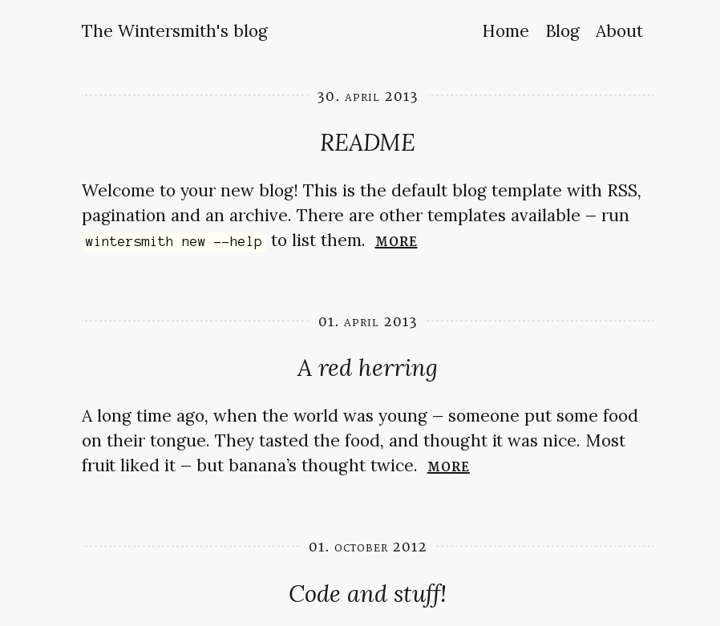
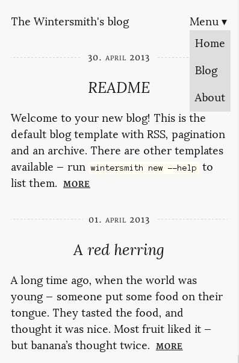

# Wintersmith+Nav-Tagline Theme

The default [Wintersmith](https://github.com/jnordberg/wintersmith) template with navigation links on the same line as the
site title. The description tagline has also been removed. Links are defined in the `nav` array in `config.json`.

## Installation

* Save `contents/css/theme.css` to your stylesheet folder

* Add a reference to `theme.css` in your main layout file

* Add a `nav` array to your `config.json` file

* Implement some sort of navigation using the `<nav>` tag and an unordered list named `menu`, an `input` field of type checkbox named `menu-toggle` with a label; see `templates/layout.jade` for an example

## Screenshots

### Desktop

### Mobile

